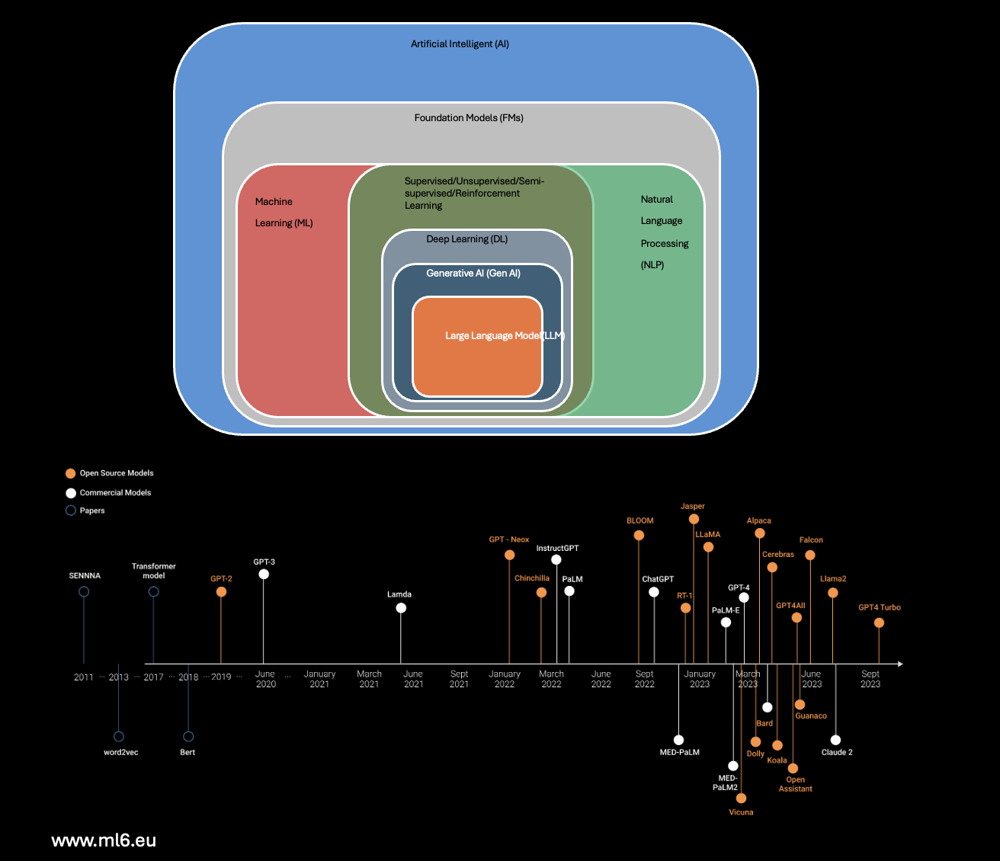

# Gen-AI / LLM
We cover important aspects of (a) General Artificial Intelligence (Gen AI) as human-like cognitive abilities for a wide range of tasks without being specifically programmed for each one. 
(b) Large Language Models (LLMs) are powerful NLP models that use deep learning techniques to understand and generate human-like text. 

_Adopted from Armand from nocode.ai_

## Here are some important notes regarding Gen AI and LLMs based on foundation models.

### Day 1 of Generative AI journey

Uncovering what Generative AI is and why it's a game-changer in the business world. Imagine AI not just analyzing data but creating new, innovative content – that's Generative AI!

Ok let's start with the basics, but don't worry, we will get into more advanced concepts as we go.

----
### Definition of terms

* Artificial Intelligence (AI): AI is the broad field of computer science focused on creating machines capable of performing tasks that typically require human intelligence.

* Machine Learning (ML): ML is a subset of AI involving algorithms and statistical models that enable computers to improve their performance on a task through experience.

* Deep Learning: Deep Learning is a subset of ML based on artificial neural networks, where algorithms learn from large amounts of data to identify patterns and make decisions.

* Generative AI: Generative AI refers to AI technologies that can generate new content, ideas, or data that are coherent and plausible, often resembling human-generated outputs.

---
### What powers Generative AI
Foundation models are large-scale artificial intelligence models that have been trained on vast amounts of data. These models are highly versatile and can be adapted to a wide range of tasks and applications.

Generative AI is one of the applications of foundation models. It involves using these models to create new content, such as text, images, or music. The foundation model serves as the underlying structure that understands and processes information, enabling the generative AI to produce new, coherent, and relevant outputs.

In simple terms, foundation models are like the core engine, and generative AI is one of the many things that this engine can power.

### What makes Foundation Models so powerful?
* Pretrained: The model has already been trained on a vast dataset before being fine-tuned or applied to specific tasks.

* Generalized: The model is capable of performing well across a wide range of tasks, not just the ones it was specifically trained for.

* Adaptable: The model can be easily modified or fine-tuned to suit particular needs or tasks.

* Large: The model is built with a substantial architecture and trained on extensive data, giving it a broad understanding and capability.

* Self-supervised: The model primarily learns by analyzing and making sense of unlabeled data, without explicit guidance on what to learn.

### and what are Large Language Models?
Large Language Models (LLMs) are a type of foundation model specifically designed to understand and generate text. They're trained on huge amounts of text, which makes them good at a wide range of language tasks. LLMs are part of the broader category of foundation models, meaning they're versatile and can be adapted for different uses involving language.

LLMs like GPT take, as input, an entire sequence of words, and predicts which word is most likely to come next. They perform that prediction of the next word in a sequence by analyzing patterns in vast amounts of text data.

There's a big debate that LLMs do more than predict the next word; they compress a "world-model" within their complex networks and weights. This is an area of active debate within the AI community. You can join the discussion about this ​here​

Two important concepts to understand in LLMs are:

* Weights: Numerical values within a machine learning model that are adjusted during training to influence the model's output in response to input data.

* Parameters: The broader set of configurable elements in a model, including weights, that determine its behavior and performance.

* Tokenization: The process of converting text into smaller units (tokens), such as words or subwords, which are used as the input for LLMs to understand and generate language.

________

Large Language Models (hashtag#llms) represent a specific category within foundation models designed to comprehend and generate human-like text across various language-related applications.

Notable LLMs making strides in the AI field include:
1. GPT-models: Introduced by OpenAI, including recent iterations like ChatGPT and GPT-4, garnering significant attention within the AI community. These models operate under a proprietary license with associated fees and usage restrictions.
2. LLaMA: An open-source suite of LLMs developed by Meta, available in various sizes ranging from 7 to 65 billion parameters. LLaMA aims to facilitate research endeavors in LLMs, offering accessibility with reduced computational requirements strictly for research purposes.
3. PaLM-2: Google's next-generation Large Language Model announced in May 2023. Built upon Google's previous AI research, PaLM-2 includes Med-PaLM-2, a specialized version fine-tuned for medical data, as detailed in a released research paper.

These LLMs exemplify advancements in AI, each offering unique capabilities and accessibility, shaping the landscape of NLP and text generation.

______

Previously, we explored the role of Large Language Models (LLMs) within the hierarchy of foundation models and introduced key types of LLMs. Let's delve deeper into general-purpose LLMs, which have the capability to handle a wide array of applications spanning human and machine languages. These LLMs can be broadly categorized into two groups (fine-tuned models according to their specific data sources):
* Task-specific LLMs:
These models are tailored to perform specific tasks, such as Meta's code Llama for generating programming codes and Snowflake Copilot for SQL code generation.
* Domain-specific LLMs:
These models are designed to excel in particular domains, such as NVIDIA's BioBERT for biomedical applications and XLNet by Google and Carnegie Mellon University for diverse language translation and generation.

These categories are determined by the specific data sources provided to the models, influencing their efficacy and performance across various applications.

[pic ref: theaidream.com]
