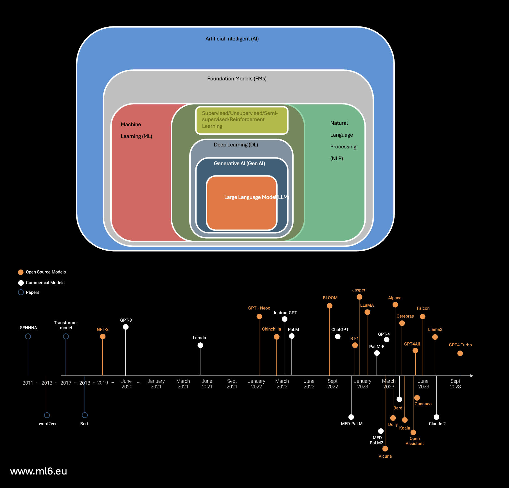
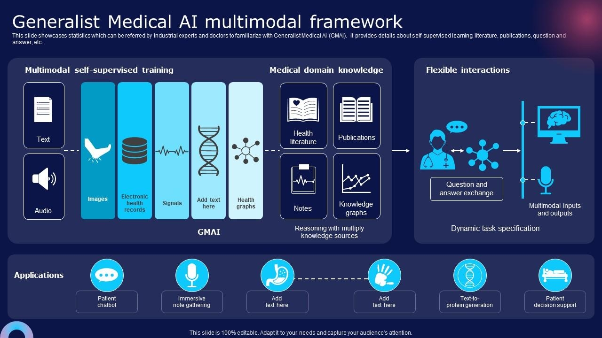

# Gen-AI / LLM
We cover important aspects of (a) General Artificial Intelligence (Gen AI) as human-like cognitive abilities for a wide range of tasks without being specifically programmed for each one. 
(b) Large Language Models (LLMs) are powerful NLP models that use deep learning techniques to understand and generate human-like text. 

_Adopted from Armand from nocode.ai_

## Here are some important notes regarding Gen AI and LLMs based on foundation models.

### Day 1 of Generative AI journey

Uncovering what Generative AI is and why it's a game-changer in the business world. Imagine AI not just analyzing data but creating new, innovative content – that's Generative AI!

Ok let's start with the basics, but don't worry, we will get into more advanced concepts as we go.

----
### Definition of terms

* Artificial Intelligence (AI): AI is the broad field of computer science focused on creating machines capable of performing tasks that typically require human intelligence.

* Machine Learning (ML): ML is a subset of AI involving algorithms and statistical models that enable computers to improve their performance on a task through experience.

* Deep Learning: Deep Learning is a subset of ML based on artificial neural networks, where algorithms learn from large amounts of data to identify patterns and make decisions.

* Generative AI: Generative AI refers to AI technologies that can generate new content, ideas, or data that are coherent and plausible, often resembling human-generated outputs.

---
### What powers Generative AI
Foundation models are large-scale artificial intelligence models that have been trained on vast amounts of data. These models are highly versatile and can be adapted to a wide range of tasks and applications.

Generative AI is one of the applications of foundation models. It involves using these models to create new content, such as text, images, or music. The foundation model serves as the underlying structure that understands and processes information, enabling the generative AI to produce new, coherent, and relevant outputs.

In simple terms, foundation models are like the core engine, and generative AI is one of the many things that this engine can power.

### What makes Foundation Models so powerful?
* Pretrained: The model has already been trained on a vast dataset before being fine-tuned or applied to specific tasks.

* Generalized: The model is capable of performing well across a wide range of tasks, not just the ones it was specifically trained for.

* Adaptable: The model can be easily modified or fine-tuned to suit particular needs or tasks.

* Large: The model is built with a substantial architecture and trained on extensive data, giving it a broad understanding and capability.

* Self-supervised: The model primarily learns by analyzing and making sense of unlabeled data, without explicit guidance on what to learn.

### and what are Large Language Models?
Large Language Models (LLMs) are a type of foundation model specifically designed to understand and generate text. They're trained on huge amounts of text, which makes them good at a wide range of language tasks. LLMs are part of the broader category of foundation models, meaning they're versatile and can be adapted for different uses involving language.

LLMs like GPT take, as input, an entire sequence of words, and predicts which word is most likely to come next. They perform that prediction of the next word in a sequence by analyzing patterns in vast amounts of text data.

There's a big debate that LLMs do more than predict the next word; they compress a "world-model" within their complex networks and weights. This is an area of active debate within the AI community. You can join the discussion about this ​here​

Two important concepts to understand in LLMs are:

* Weights: Numerical values within a machine learning model that are adjusted during training to influence the model's output in response to input data.

* Parameters: The broader set of configurable elements in a model, including weights, that determine its behavior and performance.

* Tokenization: The process of converting text into smaller units (tokens), such as words or subwords, which are used as the input for LLMs to understand and generate language.

________

Large Language Models (hashtag#llms) represent a specific category within foundation models designed to comprehend and generate human-like text across various language-related applications.

Notable LLMs making strides in the AI field include:
1. GPT-models: Introduced by OpenAI, including recent iterations like ChatGPT and GPT-4, garnering significant attention within the AI community. These models operate under a proprietary license with associated fees and usage restrictions.
2. LLaMA: An open-source suite of LLMs developed by Meta, available in various sizes ranging from 7 to 65 billion parameters. LLaMA aims to facilitate research endeavors in LLMs, offering accessibility with reduced computational requirements strictly for research purposes.
3. PaLM-2: Google's next-generation Large Language Model announced in May 2023. Built upon Google's previous AI research, PaLM-2 includes Med-PaLM-2, a specialized version fine-tuned for medical data, as detailed in a released research paper.

These LLMs exemplify advancements in AI, each offering unique capabilities and accessibility, shaping the landscape of NLP and text generation.

______

Previously, we explored the role of Large Language Models (LLMs) within the hierarchy of foundation models and introduced key types of LLMs. Let's delve deeper into general-purpose LLMs, which have the capability to handle a wide array of applications spanning human and machine languages. These LLMs can be broadly categorized into two groups (fine-tuned models according to their specific data sources):
* Task-specific LLMs:
These models are tailored to perform specific tasks, such as Meta's code Llama for generating programming codes and Snowflake Copilot for SQL code generation.
* Domain-specific LLMs:
These models are designed to excel in particular domains, such as NVIDIA's BioBERT for biomedical applications and XLNet by Google and Carnegie Mellon University for diverse language translation and generation.

These categories are determined by the specific data sources provided to the models, influencing their efficacy and performance across various applications.

[pic ref: theaidream.com]

_____

In contrast to traditional AI systems that mostly use neural networks (applying complex CNN or RNN models) as the main tool, Gen AI systems use transformers through attention mechanism that orchestrates **encoders** (that understand inputs) and **decoders** (which provide outputs) to work together and capture long-range dependencies within the input sequence and use that information to generate appropriate output sequences. By jointly training the encoder and decoder components, transformer models can effectively learn to map input sequences to output sequences across a wide range of NLP tasks (see bellow pic on attention in neural machine translation).

[pic ref:(https://lnkd.in/gbh5hnM7)]

__________

How a LLM agent work and how it can be optimized?

LLMs operate by receiving human instructions, known as prompts, and leveraging their specified models (inferences) along with software libraries and APIs to generate text resembling human output, returning the results as completions. 

To refine the generated results, we can tailor and refine the learning process through:
1- Prompt engineering
2- In-context learning (hashtag#icl)
3- Retrieval-Augmented Generation (hashtag#rag)
4- Employing reinforcement learning with human feedback (hashtag#rlhf)
5- Fine-tuning LLM model parameters
6- Providing access to a vector database for enhanced learning.

[pic ref: heidloff.net]

_________
## How to customize foundation models
Let's unlock the secrets of customizing foundation models to suit your specific needs. Understanding when and how to tune these models is crucial for optimal performance.

### Deciding When to Tune Your Model
Starting Point: Begin with prompt engineering using the largest suitable Language Model (LLM) for your task to gauge if LLMs can handle it. Experiment with various prompt formats and examples.

#### Prompting Techniques:
* Zero-Shot Prompting:

Efficiency with No Extra Data: This involves giving a natural language prompt to generate desired outputs without additional training data.

Example: "Provide a summary of the following passage: [insert text]."

* One-Shot Prompting:

A Single Example to Guide: Introduce one example along with your prompt to demonstrate the desired outcome.

Example: "Write marketing copy for WorkoutFuel protein shakes in an enthusiastic, punchy voice," along with a high-energy example text.

* Few-Shot Prompting:

Leveraging a Few Examples: Provide a handful of examples to establish the pattern or style for the model to replicate.

Example: To generate meeting summaries, give 2-3 examples before asking the model to create new ones.

### Data-Driven Tuning for Deeper Customization
* Fine-Tuning: Adjusting model weights on a specific dataset to cater to your unique objectives, like customizing tone or addressing complex prompts.

* Parameter-Efficient Fine-Tuning (PEFT): Delta tuning updates only a small subset of parameters, offering a faster, cost-effective alternative to traditional fine-tuning.

### PEFT Techniques:
Parameter-Efficient Fine-Tuning (PEFT) is a more cost-effective and efficient method because it focuses on optimizing a small subset of model parameters, reducing computational resources and training time while maintaining high-performance levels. There are multiple techniques:

* Prefix Tuning: Attaches vectors with free parameters to input embeddings, training them while keeping the LLM frozen.

* Prompt Tuning: A simpler variant of prefix tuning, adding a vector only at the input layer.

* P-Tuning: Automates the search and optimization of prompts using an LSTM model.

* LoRA: Low-Rank Adaptation adds update matrices to existing weights, training these new weights.

### Choosing the Right Technique:
Goal-Oriented Approach: Select the customization method based on your specific goals and the data you have. For instance, zero-shot and few-shot prompting work well with minimal data, while data-driven tuning is ideal for more complex, data-rich tasks.

Customizing foundation models can significantly enhance their performance on specific tasks, making them more aligned with your business objectives.
_________
## The most popular LLMs available
Let's navigate the world of Large Language Models (LLMs) by understanding the key differences between open-source and proprietary models and services, and exploring some of the most popular LLMs available today.

### Open Source LLMs:
Accessible and Collaborative: These models are freely available for use, modification, and distribution, promoting community-driven development and innovation.

Examples of Open Source LLMs:

GPT-Neo/GPT-J: Developed by EleutherAI, these models are open-source alternatives to OpenAI's GPT models, offering similar capabilities.

BERT: Developed by Google, BERT has been a groundbreaking model for understanding context in natural language, widely used in various applications.

I listed the Top Open Source LLMs a few weeks back on Linkedin. Here's the ​link​

### Closed Source LLMs:
Commercial and Proprietary: These models are developed and maintained by private entities, often requiring licenses or subscriptions for access.

Examples of Closed Source LLMs:

OpenAI's GPT-3/GPT-4: Known for their advanced capabilities, these models have set benchmarks in generative AI but are accessible mostly through API with usage costs.

Google's LaMDA: A cutting-edge model designed for conversational AI, used internally by Google.

### The Game Changer: Llama 2
* Accessibility and Versatility: Meta's Llama 2 has been released as an open-source AI model, making it accessible for everyone from startups to researchers. Its availability in different sizes (7B, 13B, 70B-parameter models) offers a range of options for fine-tuning and deployment.

* Innovation and Privacy: As an open-source model, Llama 2 removes barriers to AI adoption and addresses data privacy concerns by allowing private hosting and customization with your own data.

* Performance Benchmarking: Llama 2 stands on par with models like GPT-3.5 in terms of performance, particularly excelling in generating helpful responses for prompts. However, it shows less proficiency in coding tasks compared to other specialized models.

* Cost and Community Benefits: Meta’s open-sourcing of Llama 2, despite the substantial development cost, taps into the collective wisdom of the global AI community, accelerating innovation and potentially leveling the playing field against closed-source counterparts.

#### Why the Distinction Matters: 
Understanding the differences between open source and closed source LLMs is crucial for businesses and developers. Open source models offer transparency and the opportunity for customization, while closed source models, often backed by significant resources and research, provide robust, state-of-the-art capabilities but with usage restrictions and costs.

_________
## The GenAI Stack: A Modular, Integrated System
Understanding the GenAI Architecture: This system includes data pipelines, training and inference engines for LLMs, model registries, deployment monitoring, and user interfaces. Tools like LangChain offer orchestration layers for rapid transitions from data to models to apps.

### Key Elements of the GenAI Stack:
1- Embeddings (Vectors): These transform high-dimensional data into lower-dimensional vectors, retaining essential information in a more manageable form.

2- Vector Database: Stores and indexes vector representations for quick retrieval, supporting operations like vector search and similarity rankings, forming the backbone of vector infrastructure in AI.

3- LangChain: An open-source framework built around LLMs, LangChain facilitates the design and development of various GenAI applications, including chatbots and Generative Question-Answering (GQA).

4- LLMs and Prompts: The core of generative capabilities, LLMs respond to prompts to generate text, making them essential for applications like content creation and customer service.

### Building a Simple GenAI App - Step-by-Step:
* Load Document: Begin by loading the document or data source.

* Split into Chunks: Break the document into manageable parts.

* Create Embeddings: Convert these chunks into vector representations using embeddings.

* Store in Vector Database: Save these vectors in the database for efficient retrieval.

* User Interaction: Receive queries or input from the user and convert them into embeddings.

* Semantic Search in VectorDB: Connect to the vector database to perform a semantic search based on the user's query.

* Retrieve and Process Responses: Fetch relevant responses, pass them through an LLM, and generate an answer.

* Deliver Answer to User: Present the final output generated by the LLM back to the user.

Understanding and utilizing the components of the GenAI stack is key for businesses looking to leverage AI for innovative applications. This modular approach allows for customization and scalability, fitting various business needs and goals.

[pic ref: https://newsletter.nocode.ai/p/generative-ai-development-stack]

_______
## SLM: Short Language Model
Now, we focus on the emerging trend of Small Language Models (SLMs) in the business world and their growing importance alongside Large Language Models (LLMs).

### Understanding Large Language Models: A Refresher
* Foundation of Today's NLP: LLMs, trained on vast text data, excel in generating coherent text and performing complex language tasks.

* Size and Complexity: Models like GPT-3 (175 billion parameters) and PaLM (540 billion parameters) represent the massive scale of LLMs, offering advanced capabilities but sometimes leading to challenges in accuracy and behavior.

but LLMs are very expensive:

running ChatGPT costs approximately $700,000 a day

### What are Small Language Models (SLMs)?
* Defining SLMs: Generally defined as models with up to 20 billion parameters, SLMs are tailored for specific business tasks like chat, analytics, and content generation.

* Agility and Customization: SLMs offer a balance of capability and control, making them well-suited for focused business applications.

### Advantages of SLMs
* Development and Risk Control: Easier to build and modify, SLMs reduce risks like bias and hallucinations due to simpler knowledge representations.

* Efficiency and Sustainability: Being lightweight and less computationally intensive, SLMs are ideal for deployment on smartphones and edge devices, contributing to sustainability.

* Cost-Effectiveness: SLMs offer significant cost savings, making AI more accessible for businesses.

The speed of learning SLMs allow is huge, too. They're within the reach of so many more teams at lower cost. It just lets more innovation cycles happen faster - Brad Edwards

### Benchmarking SLMs Against LLMs
* Performance Comparisons: For instance, Mistral 7B outperforms larger models in certain benchmarks, demonstrating that SLMs can compete with or even surpass LLMs in specific tasks.

* Focused Training: SLMs like IBM Granite, despite smaller size and data, show competitive performance due to targeted training on industry-specific data.

### Tuning Small Language Models
* Customization Techniques: Similar to LLMs, SLMs can be fine-tuned using various methods to enhance performance for specific use cases.

* Example of Tuning: IBM’s Granite series, for instance, underwent specialized training for coding, showing how SLMs can be tailored to specific domains.

### Use Cases of SLMs
* Versatile Applications: SLMs are effective in text generation, chatbots, Q&A, and summarization, offering optimized solutions for resource-limited scenarios.

* Domain-Specific Tuning: SLMs can be trained for specialized fields like medical, legal, or technical translation, offering more accurate and relevant outputs than general-purpose LLMs.

*In Summary: Balancing Capability and Practicality: SLMs are emerging as a practical alternative to LLMs in many business scenarios, offering a mix of specialized capabilities and control.*

SLMs represent a significant development in the AI landscape, providing businesses with more agile, cost-effective, and focused solutions for integrating AI into their operations.

________
## How does RAG help to adopt LLMs to our use cases?

Retrieval-augmented generation (RAG) as a powerful framework helps to enhancing the capabilities of LLMs and adapting them to a wide range of use cases by integrating retrieval mechanisms into the generative process.. Here's how RAG facilitates this process:

* 1- Combining generative and retrieval approaches: combines the strengths of generative and retrieval models. Generative models, like LLMs, create diverse text, while retrieval models excel at fetching specific information. By merging these, RAG optimizes both methods.
* 2- Improved content relevance: empowers LLMs to tap into structured data or existing content, boosting text relevance for more accurate and contextually appropriate text (enhancing output quality).
* 3- Reducing bias (or other hallucinations) and improving diversity: mitigates bias and enriches text diversity by incorporating insights from various sources so that LLMs can produce balanced and varied outputs (minimizing bias).
* 4- Enhancing task-specific performance: allows LLMs to adapt to specific tasks by retrieving relevant information. This fine-tuning capability enables LLMs to meet task requirements (enhancing overall performance).

[pic ref: medium.com]

_____

## Future Trends in AI
Now let's ventur into the future to explore the exciting innovations we can expect in the next decade. 

### Where Do We Come From?
Understanding AI's journey is key to predicting its future. The past decade laid the foundation for advancements in machine learning and neural networks. Now, we're poised to build on this legacy, driving AI towards more sophisticated and nuanced applications.

In traditional machine learning, individual siloed models require task-specific training and a significant amount of human-supervised learning. The limit on performance & capabilities for supervised learning are humans.

In contrast, foundation models are massive multi-tasking systems, adaptable with little or no additional training, utilizing pre-trained, self-supervised learning techniques. The limit on performance & capabilities is mostly on computing and data access (not labeling).

[pic ref: https://newsletter.nocode.ai/p/generative-ai-development-stack]

### Synthetic Data
If the limit to a better model is more data, why don't create it artificially? The rise of synthetic data is a game-changer. It's about creating artificial datasets that can train AI without compromising privacy or relying on scarce real-world data. This innovation is set to revolutionize fields from healthcare to autonomous driving, making AI training more accessible, ethical, and comprehensive.

We will see increased usage of synthetic data because it overcomes data scarcity by allowing limitless generation, ensures balanced data distribution to avoid biases, and is cost-effective, bypassing the expensive and time-consuming process of real-world data collection and labeling.

### Multimodality
Multimodality is the future of AI's interaction with the world. By integrating text, image, sound, and more, AI can understand and respond to complex queries with unprecedented accuracy. This holistic approach will deepen AI's integration into daily life, from smarter virtual assistants to more intuitive educational tools.

[pic ref: https://newsletter.nocode.ai/p/generative-ai-development-stack]

### Reinforcement Learning
Want to take it to the next level? What if you could train the AI without data? Meet Reinforcement Learning, a technique poised to make significant strides. By learning through trial and error, AI systems will become more autonomous and capable of solving complex, real-world problems. This means smarter algorithms in everything from financial forecasting to climate change modeling.

Check out this video to see a demonstration of Reinforcement Learning in action:

[Multi-Agent Hide and Seek](https://www.youtube.com/watch?v=kopoLzvh5jY)

### Giving Tools to AI
In the next decade, AI will evolve beyond being just a tool to becoming a creator of tools. We will see AI designing software, crafting algorithms, and contributing to AI research. AI agents will autonomously manage projects in a continuous loop, executing tasks, enhancing results, and generating new tasks based on objectives and past outcomes. Their workflow will include task execution, result enrichment, task creation, and prioritization. Equipped with integration capabilities, these agents will be able to search for information in CRMs, access databases, send emails, and more. Frameworks like BabyAGI and Auto-GPT are already emerging to test these concepts.

### Beyond Chats
While chatbots and conversational AI have made leaps, the future extends far beyond text. Expect AI that can seamlessly interact across various formats, offering richer, more immersive experiences. Whether it's in education, entertainment, or customer service, AI will engage us in more meaningful, dynamic ways.

_______________
## How to fine-tune LLMs?

Fine-tuning language models is about adjusting the parameters of the underlying model so that one can modify/better the results. Generally it can be performed through below steps: 

* 1- Select pre-trained LLM: Choose a pre-trained language model that best suits the use case (GPT-3, BERT, RoBERTa, T5, ...).
* 2- Identify related data set to the used case: Organize/preprocess the dataset and format the data according to the requirements of the language model ( tokenization, splitting into training, validation, and test sets,...).
* 3- Define task-specific objective: Determine the specific task you want to fine-tune the language model for (text classification, text generation, question answering, summarization, ...).
* 4- Fine-tuning strategy: Decide on the fine-tuning strategy based on your dataset size and computational resources (fine-tune the entire model or only specific layers).
* 5- Fine-tune model: Train the language model on the task-specific dataset. During training, adjust the model's parameters based on the task-specific objective and minimize the loss function.
* 6- Hyperparameter tuning: Experiment with different hyperparameters (learning rate, batch size, and number of training epochs to optimize performance).
* 7- Evaluation: Evaluate the fine-tuned model (accuracy or BLEU score for language generation, ...).
* 8- Iterative refinement: Iterate on the fine-tuning process by analyzing model performance, identifying weaknesses, and making adjustments to improve performance further.
* 9- Deployment: When the performance of the fine-tuned model is acceptable, deploy/integrate it at production level.

[pic ref: assemblyai.com]  

____
## What are the necessary steps of taking LLM applications to production?

Bringing Language Model (LLM) into production involves several key steps to ensure that the model performs reliably and effectively in real-world scenarios:  

* 1- Model development and training: using appropriate data (e.g. text corpora) ensuring that it learns to generate coherent and contextually relevant text and fine-tuning the pre-trained language model (if applicable) on domain-specific data or tasks to improve performance on specific objectives.

* 2- Evaluation and validation:of performance of the language model using appropriate metrics (perplexity, BLEU score, or human evaluation) for quality and effectiveness.

* 3- Integration with infrastructure: at the production infrastructure (web servers, APIs, or micro-services) to enable seamless access and usage by other systems/applications.

* 4- Scalability and performance optimization: for scalability and performance to handle production-level workloads efficiently (model parallelism, distributed training, model pruning, ...) to improve scalability and reduce inference latency.

* 5- Deployment and testing: at production environments (cloud platforms or on-premises servers) ensuring compatibility with the target deployment environment via unit tests, integration tests, and end-to-end tests, to verify the correctness and robustness of the deployed model.

* 6- Monitoring and maintenance: to track the performance and health of the deployed language model in real-time via setting alerts/notifications to detect anomalies/degradation in model performance and take appropriate corrective actions.

* 7- Feedback loop and iteration: to gather insights from the model's usage in production and user feedback to iteratively improve the language model, whether through additional training data, fine-tuning, or architectural enhancements.

* 8- Security and compliance: to protect the language model and associated data from unauthorized access or misuse via relevant regulations and standards (data privacy laws, industry-specific requirements and so on).

[pic ref: sreent.medium.com] 

----
## How feature injection can enhance a LLM agent?

Feature injection for a Large Language Model (LLM) agent involves augmenting the input data with additional features. It enriches the input data fed into the LLM agent, providing it with a more comprehensive understanding of the context, domain, users, and temporal dynamics. in the end, this results in improved performance, accuracy, and relevance of the LLM agent's responses across various applications and scenarios.

### Some main applications of feature injections are:

*1- Contextual information: adding contextual information (timestamps, demographics, environmental variables, ...) to generate more accurate responses.
*2- Domain-specific knowledge: provides relevant knowledge about the domain it's operating in (e.g. medical chatbot; see the enclosed photo) 
*3- User-specific information: can personalize the LLM agent's responses (includes user preferences, past interactions, user profiles,... ) 
*4- Temporal context: enables the LLM agent to generate responses that are sensitive to changes over time, such as offering different recommendations during different times of the day.
*5- Sentiment analysis: Injecting sentiment-related features allows the LLM agent to understand the emotional context of the input text for more empathetic or appropriate responses.

[pic ref: I.C. Hsu & J.D. Yu, Multimedia Tools and Applications, Springer 81, 2022] 

----
## How to compare diverse LLM agents against their capabilities/applications?

A well-known tool is **`LMSYS Chatbot Arena'** which is an open-source platform that evaluates LLMs with respect to their alignment to human preferences (via human pairwise comparisons) applying the Bradley-Terry model via ranking in Elo-scale. More details can be found in this paper "Chatbot Arena: An Open Platform for Evaluating LLMs by Human Preference" by Wei-Lin Chiang et al. The comparison can be performed through this website: chat.lmsys.org.

The __ELO score__ refers to a rating system used to assess the relative skill levels of AI models/agents in competitive scenarios, such as in providing text outputs, games or even simulations. The ELO score is named after its creator, Arpad Elo, and is commonly used in chess to rank players based on their performance against each other. Another application is to rank different AI models based on the aesthetic quality of the generated images as assessed by human judges or other objective criteria. 

Overall, Arena ELO rating assists researchers/developers to identify and prioritize the most effective or creative AI models for further development and/or deployment (pic ref report as of today, April 22, 2024).

[pic ref: chat.lmsys.org/?leaderboard] 

---
## What does an AI-agent orchestration do? 

By orchestration in an AI agent, we usually mean the process of organizing agents based on defined objectives and selected models, coordinating input and output for each of the selected models and then agent-to-agent data/info flow management. 

Within LLM operations (LLMOps) tools, each AI agent (as instances of LLMs) to perform specific tasks can be coordinated with other components such as external applications though such orchestration frameworks. 

Orchestration library is a subtype of AI-agent orchestration that provides efficient access to external data as well as other APIs connected to the AI-agent. This is usually done by utilizing RAG to keep the model updated via current information. 

[pic ref: medium.com] 

-----
## What are transformers and why are they more beneficial than traaditional NNs?

Recent transformers offer several advantages over previous neural network models in Gen AI agents:

* Attention Mechanism: Transformers employ a self-attention mechanism that allows them to focus on different parts of the input sequence when generating output. This mechanism enables better capturing of long-range dependencies and improves the model's ability to understand context.
* Parallelization: Transformers can process input sequences in parallel, unlike recurrent neural networks (RNNs) that process sequences sequentially. This parallelization leads to faster training times and more efficient utilization of computational resources.
* Positional Encoding: Transformers incorporate positional encoding to provide information about the position of tokens in the input sequence. This positional information helps the model distinguish between different elements in the sequence and enables it to handle variable-length inputs more effectively.
* Scalability: Transformers are highly scalable and can be applied to a wide range of tasks, including natural language processing (NLP), image processing, and speech recognition. They have been successfully used in large-scale applications with massive datasets, demonstrating their scalability and effectiveness.
* Transfer Learning: Transformers support transfer learning, allowing pre-trained models to be fine-tuned on specific tasks with relatively small amounts of task-specific data. This capability enables rapid development and deployment of Gen AI agents tailored to specific domains or applications.
  
_Overall, recent transformers offer improved performance, scalability, and flexibility compared to previous neural network models, making them a preferred choice for developing Gen AI agents._

[pic ref: medium.com] 
---

## What is a elf-attention model
A self-attention model, also known as a transformer model, is a type of neural network architecture that can capture long-range dependencies in data more effectively than traditional models like RNNs (Recurrent Neural Networks) or CNNs (Convolutional Neural Networks). In a self-attention model, each input element interacts with all other elements, enabling it to attend to different parts of the input sequence with varying degrees of importance. This mechanism allows the model to capture contextual information more efficiently, making it suitable for tasks involving sequential or structured data.

### Comparing self-attention models with RNNs and other neural network models:

### Capturing Long-Range Dependencies:
Self-attention models excel at capturing long-range dependencies in data due to their ability to attend to all input elements simultaneously.
RNNs, on the other hand, suffer from the vanishing gradient problem, limiting their ability to capture long-range dependencies effectively.
Other neural network models like CNNs may struggle with capturing long-range dependencies, especially in sequential data.
### Parallelization and Computational Efficiency:
Self-attention models can be highly parallelized, making them computationally efficient, especially for large datasets.
RNNs are inherently sequential, which limits their parallelization and may lead to slower training times.
CNNs are also parallelizable but may require significant computational resources for large-scale tasks.
### Interpretability and Explainability:
Self-attention models offer better interpretability and explainability compared to RNNs, as they explicitly capture relationships between input elements.
RNNs are sequential and stateful, making it challenging to interpret their decisions at each time step.
CNNs focus on local patterns, which may not provide a comprehensive understanding of global relationships in the data.
### Training Stability:
Self-attention models are more stable during training compared to RNNs, as they do not suffer from issues like vanishing or exploding gradients.
RNNs may encounter difficulties in training due to gradient instability, especially in deep architectures.
CNNs are generally stable during training but may require careful initialization and regularization techniques.

_In summary, self-attention models offer several advantages over traditional neural network architectures like RNNs and CNNs, particularly in capturing long-range dependencies, parallelization, interpretability, and training stability. However, the choice of model depends on the specific requirements of the task and the nature of the data._

-----

## Transformers through an advanced lens

As a particular type of deep learning techniques, sequence-to-sequence models that accepts a sequence of items (letter, word, sentence, features of an image, frames of a video, ...) as input and returns another  sequence of items as output. This models play crucial roles in machine translation, text summarization, and image captioning (e.g. Google Translate in 2016). The pioneer researches on such models can be found in [Sutskever et al., 2014] and [Cho et al., 2014].

One important type of sequence-to-sequence models is recurrent neural network (RNN). RNNs have provided import solutions to NLP challenges. However, RNNs are generally slow in training sequences while processing one element at a time and maintaining a hidden state to capture information from previous elements. Another failure aspect of RNN models associates with the vanishing gradient problem (as common issue in NNs). 

Long-short-term memory (LSTM) as a type of RNN can handle the vanishing gradient problem, but is not highly effective for longer sequences and could be even slower than traditional RNN models. 

To solve all above restrictions, transformers have been provided that work with 'self-attention' mechanism. Self-attention, in fact, attends diverse parts of the input sequence at different times without any further need of external inputs. Transforms can solve the issue with vanishing gradient problem via using multi-headed attention model (using several self-attentions), but also efficiently use GPUs for parallelized version of the input sequences and excel the training process.

[pic ref: medium.com] 

---
## Attention vs Self-attention in Transformers:

Attention mechanism: enables models to focus on crucial parts of the input, mimicking human perception. They facilitate understanding by capturing long-range context and relationships within data focusing on relationships between input and output sequences. Despite their effectiveness, attention mechanisms face scalability challenges.

Self-attention mechanism: focuses on a single sequence, allowing a model to learn about itself. Unlike regular attention, it relates input to output within the same sequence. 

Self-attention can be realized through diverse kernel (score) functions, offering a range of types. Among these, the softmax function stands out as a commonly employed choice, referred to as scaled-dot product attention (SDP) (for more details see [Vaswani et al. Proc. NeurIPS 2017] and [Lin et al: arXiv:2106.04554v2]).

[pic ref: medium.com] 

To avoid the complexity of SDP,  we note that some tokens may are less crucial; not all parts of the input sequence requires equal attention and thus there are some methodologies to simplify SDPs (more details in medium.com): 

1- Sparse attention: sparsifies the attention matrix 

2- Matrix factorization: decomposes and approximates the attention matrix with a lower-rank matrix without losing too much information.

3- Locality-sensitive hashing: computes nearest-neighbor search from the attention matrix to choose related tokens.

4- Kernel attention: considers the softmax function as a kernel for computing the self-attention matrix more efficiently.

[pic ref: medium.com] 

---
## Non-NLP generative models
They are algorithms that can generate new data samples resembling the characteristics of the training data without being specifically tailored for natural language processing (NLP) tasks. Some examples of non-NLP generative models include:

* Generative Adversarial Networks (GANs): GANs consist of two neural networks, a generator and a discriminator, which are trained simultaneously through a min-max game. The generator learns to produce realistic samples from random noise, while the discriminator learns to distinguish between real and generated samples. GANs have been used for generating realistic images, videos, and music.
* Variational Autoencoders (VAEs): VAEs are probabilistic models that learn to encode and decode data samples in a latent space. They consist of an encoder network that maps input data to a latent space and a decoder network that reconstructs the input data from latent representations. VAEs are used for generating new images, text, and other types of data.
* Normalizing Flows: Normalizing flows are generative models that learn invertible transformations to map a simple distribution (e.g., Gaussian) to a complex data distribution. By applying these transformations to random noise samples, normalizing flows can generate new data samples with desired characteristics. Diffusion models are a type of normalizing flow model that models the evolution of data density over time.
* Autoregressive Models: Autoregressive models predict the probability distribution of each feature in a data sample conditioned on previous features. By sampling from these conditional distributions iteratively, autoregressive models can generate new data samples one element at a time. Examples of autoregressive models include PixelCNN and WaveNet.
* Boltzmann Machines: Boltzmann Machines are stochastic neural networks that model the joint distribution of binary variables. They use a Markov chain Monte Carlo (MCMC) sampling approach to generate new data samples by exploring the energy landscape of the model. Boltzmann Machines are used in various applications, including image generation and collaborative filtering.
These non-NLP generative models have applications in diverse domains such as computer vision, audio generation, molecular design, and anomaly detection. They offer powerful tools for synthesizing new data samples and exploring the underlying structure of complex datasets.

---
## Transformers vs. diffusion models 
Both are both powerful frameworks in machine learning, but they differ in their underlying principles and applications.

### Transformers
Architecture: Transformers are based on self-attention mechanisms, allowing them to capture dependencies between input tokens across various positions in the sequence.
Applications: Transformers are widely used in natural language processing tasks such as language translation, text generation, sentiment analysis, and language understanding.
Strengths: They excel at capturing long-range dependencies and contextual information from input sequences, making them effective for sequential data processing tasks.

### Diffusion Models
Architecture: Diffusion models are generative models based on the concept of iteratively diffusing noise throughout the input data to generate samples.
Applications: Diffusion models are used in image generation, image inpainting, denoising, and other generative tasks where high-quality sample generation is required.
Strengths: They are known for their ability to generate high-fidelity samples and perform image editing tasks such as inpainting and super-resolution.

_In summary, while transformers are primarily used for sequence modeling and processing tasks in natural language processing, diffusion models are focused on generative tasks in computer vision and image processing. Each model has its strengths and is suited to different types of applications._

---
## what does ChatGPT-4o #chatgpt4o do?

Multi-modal foundation models are advanced AI architectures which process and understand diverse types of data (text, images, audio, video and any combination of them) simultaneously. Such models, in fact, integrate NLP, image/audio/video-processing techniques to enrich understanding of contents across different modalities (multi-modal  enablement).

There have been several multi-modal foundation models available:

1- OpenAI's Contrastive Language-Image Pretraining (CLIP) model: associates images to texts and responses to either formats.

2- Google's T5, Virtex as multimodal transformers: associates images, texts. 

3- Google's Bidirectional Encoder Representations from Transformers (BERT): transformer-based architectures for multi-modal tasks.

4- ChatGPT-4o ('o' for 'omni'): the most recent multi-modal AI agent that uses real-time human-like (emotional) speech and is capable of understanding texts, concepts, images, videos to discuss/analyze contents and interact amongst diverse modalities.

.... 

Combining information from different modalities, multi-modal foundation models can provide more nuanced and contextually relevant responses compared to single-modal agents (see below pic for  application of multi-modal AI in medicine).

[pic ref: slideteam.net] 

